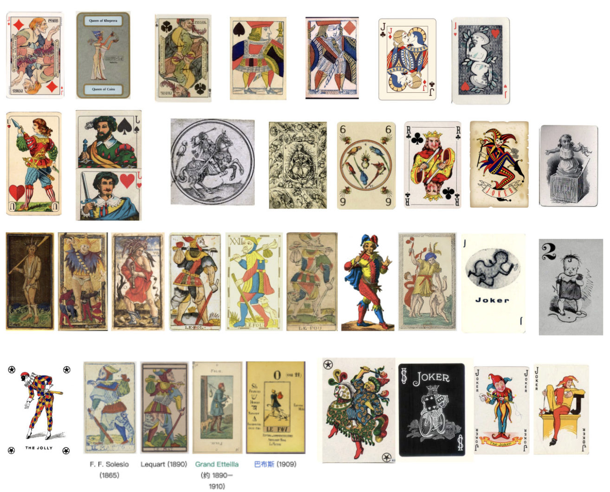

# Miaozheng Qiu

## Research
My research is centered around the characters depicted on playing cards, focusing on their imagery, purposes, and stories, as well as how players can engage with these characters through interaction.

-Story of characters

In poker, the characters on the cards are static and almost invisible to the players, who focus only on numbers and suits. Tarot, however, shifts attention to the card imagery.Every figure, gesture, and symbol is loaded with meaning. The characters are no longer silent decorations but narrators of hidden stories.

At the same time, the vertical symmetry in cards has been widely used by designers to create contrasting character designs.

Some designs use symmetrical structures to represent opposing states of a character.

-Ceremony

In tarot cards, the placement of the cards is crucial because it is directly related to the content of the player’s divination. In contrast, playing cards do not have explicit positional information or symbolic meaning. However, it is worth noting that when playing cards were first created, they were also used for divination, so the position of the cards may have been significant at that time as well.

-Joker

The joker is a special card in poker; unlike other character cards, it does not have an independent historical or narrative background.

In traditional Marseille tarot, the Fool is depicted as a joker.

The mythological archetype of the Fool is Dionysus, the Greek god of wine.

[research](https://miro.com/welcomeonboard/U1lqMnNGTjk2c09DN1RUZzBRc1JhYlI0cDRZeWVEMkxScy95dUJ4MEZEaUxhNC9xWVl5Rm5MdWI3MjdkbDB0MjJwT09iaGllZUUyRHl5R3EzVWRibHk4VlBNTTM1d2NvMGg4akRHSHdKTGlSWXJ5NUhHNmxsUTdYUFZtSWJBTDdnbHpza3F6REdEcmNpNEFOMmJXWXBBPT0hdjE=?share_link_id=127942518419)

## Characters of cards
The characters on each card feel like they’re trapped in a mirror, frozen and waiting. Through players actions, they can bring them to life, stepping into charaters' world and experiencing their stories, emotions. Instead of just looking at the cards, you get to interact with the characters, guiding them, making choices, and seeing how their story unfolds in real time.

Players body become the controller. Movements players make translate directly to what the characters do. You might help a character relive a memory, explore important moments in their life. Every gesture players make become part of the storytelling, turning a passive experience into an active adventure.The cards themselves change too. 

In the end, the cards are more than just pictures; they’re living, interactive experiences. By animating the characters and connecting them to players' movements, the design lets players dive deep into their stories, creating a playful, immersive way to explore the rich lives hidden inside each card.

1. idea one - three births of joker
Players are presented with a card character silhouettes and bring the Joker to life by imitating his actions.
Players experience the tale of the god of wine’s three incarnations and advance the story by performing core actions.

2. idea two - jounery of joker
There is a series of Joker cards representing the key narrative events in the Joker’s journey. Players trigger these events by performing the same actions depicted on the cards. Such as the story of “turning stone into gold”, while simultaneously engaging in character role-play through their movements.

## Keyword
Marionette

## User Journey

## Novel Combinations
- imitate
- role play
- story